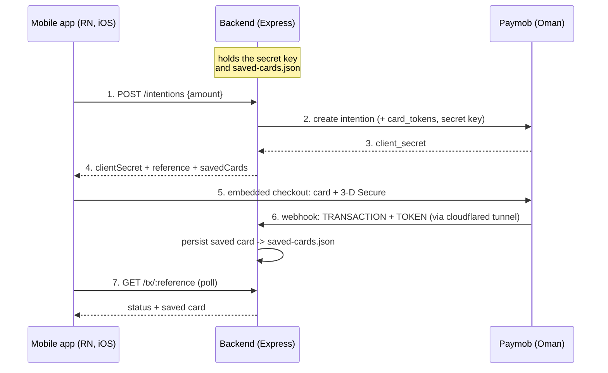
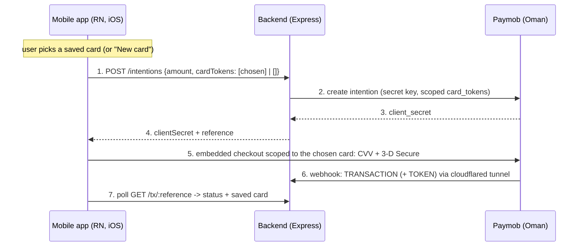

# Demo architecture — payments and saved cards

How the example app, the demo backend, and Paymob divide the work. The guiding
rules: the **secret key stays server-side**, and the **webhook is the source of
truth** for the transaction result and the saved card.

> Scope: this describes the demo in [`example/`](example) — the React Native app
> and the minimal backend in [`example/server/`](example/server). It is not part
> of the published SDK.

## Two payment flows

The app opens on a flow selector with two options:

- **Embedded checkout** — the intention offers all saved cards; Paymob's native
  element renders them (in Paymob's own order) plus a new-card form.
- **Saved cards (app-driven)** — the app renders its own single-select dropdown
  of saved cards (plus a "New card" option); the selected card stays visible on
  the closed dropdown. The chosen card **scopes the intention**
  (`card_tokens = [that token]`), so the embedded element opens showing **only
  that card** and collects its CVV. This honours the user's selection while
  keeping CVV + 3-D Secure inside Paymob's UI.

Both share the top-up screen (amount, quick-add chips, saved-card list, redirect
checkbox) and the same webhook + result-poll plumbing.

> A truly headless token charge (no Paymob UI) was prototyped but isn't viable
> on this integration: Paymob's `payments/pay` requires the card's CVV/CSC and
> won't accept it outside its own UI (a no-CVV charge needs a MOTO integration).
> So both flows go through the embedded element; the app-driven flow just scopes
> it to the selected card.

## Embedded checkout flow

1. **App → Backend** — the app sends only the amount (`POST /intentions`).
   Nothing sensitive leaves the device.
2. **Backend → Paymob** — the backend creates the intention with the **secret
   key** and the persisted **`card_tokens`** (read from `saved-cards.json`), so
   the checkout can offer saved cards.
3. **Paymob → Backend** — returns the intention's `client_secret`.
4. **Backend → App** — returns `clientSecret`, a `reference` for looking the
   result up later, and the `savedCards` list.
5. **App → Paymob** — the native `PaymobCheckoutView` handles card entry and
   3-D Secure directly. The backend is not in this loop.
6. **Paymob → Backend** — two server-to-server callbacks arrive over the
   cloudflared tunnel: `TRANSACTION` (status) and `TOKEN` (saved card). The
   backend correlates them by order id and persists the card to
   `saved-cards.json`.
7. **App → Backend** — the app polls `GET /tx/:reference` for the confirmed
   status and saved card, then shows the result labelled "confirmed by backend".

The top-up screen also lists the saved cards and lets the user **rename** each
one (a nickname is shown in place of the card type), **delete** it, or
**drag to reorder** the list; those changes are persisted through
`PATCH` / `DELETE /saved-cards/:token` and `PUT /saved-cards/order`, so they
also flow into the next intention's card tokens.

## App-driven saved-card flow

The app owns the selection UI (a single-select dropdown + "New card"), then
scopes the intention to the chosen card so the embedded element shows only that
card and collects its CVV. Selecting "New card" scopes the intention to no saved
cards, so the element shows the new-card form.

Why scoping (not a headless charge): Paymob re-sorts saved cards by its own rule
and ignores the `card_tokens` order, so honouring a user-chosen selection means
the app must decide the card. Scoping the intention to one token makes the
element display just that card, keeping CVV/3-D Secure inside Paymob's UI.

## Components

| Component | Role | Responsibility |
| --- | --- | --- |
| Mobile app | Client | Flow selection, amount entry, saved-card selection (dropdown in the app-driven flow; an editable/reorderable list in the embedded flow), embedded checkout (scoped per selection), result popup. |
| Backend (`example/server`) | Server | Holds the secret key; creates intentions; receives webhooks; persists cards; serves the result poll. |
| Paymob | Provider | Oman intention API + embedded checkout; sends the authoritative callbacks. |
| `saved-cards.json` | Store | Persists saved-card tokens across restarts (gitignored — holds PII). |
| cloudflared tunnel | Delivery | Exposes the webhook publicly so Paymob can reach `localhost`. |

## Principles

- **The secret key never ships in the app.** Only the backend uses it, and only
  when creating an intention.
- **The webhook is the source of truth.** The in-checkout success callback is
  best-effort UX; order fulfilment and stored tokens follow the server-to-server
  webhook.
- **Two webhooks, correlated by order id.** `TRANSACTION` and `TOKEN` arrive
  separately. The order id is normalized to a string for correlation because
  Paymob sends it as a number in `TRANSACTION.obj.order.id` and a string in
  `TOKEN.obj.order_id`.
- **The poll waits out the token lag.** `TOKEN` trails `TRANSACTION` by a few
  seconds, so the app keeps polling briefly after the status settles before
  showing the saved card.
- **Saved-card tokens pre-load the checkout.** They are passed into the
  intention as `card_tokens`; Paymob silently drops invalid or expired ones.

## Backend endpoints

| Endpoint | Purpose |
| --- | --- |
| `POST /intentions` | Create the intention (secret key). Optional `cardTokens` scopes the offered cards: all (omit), `[token]` (one), or `[]` (none). Returns `clientSecret`, `reference`, `savedCards`. |
| `POST /paymob/webhook` | Paymob's `notification_url`; captures the `TRANSACTION` result and `TOKEN` saved card. |
| `GET /tx/:reference` | The result the app polls: status plus saved card. |
| `GET /saved-cards` | Lists the cards persisted from token callbacks. |
| `PATCH /saved-cards/:token` | Set or clear a card's nickname. |
| `DELETE /saved-cards/:token` | Remove a saved card. |
| `PUT /saved-cards/order` | Set the display order (array of tokens). |

## Not production

This is a demo: in-memory transaction results, a local JSON store, test
credentials, and optional HMAC verification. For production, verify the webhook
HMAC on every callback, scope saved cards to the authenticated customer, and use
a real datastore. See [`example/server/README.md`](example/server/README.md) for
running it (including the tunnel requirement).
